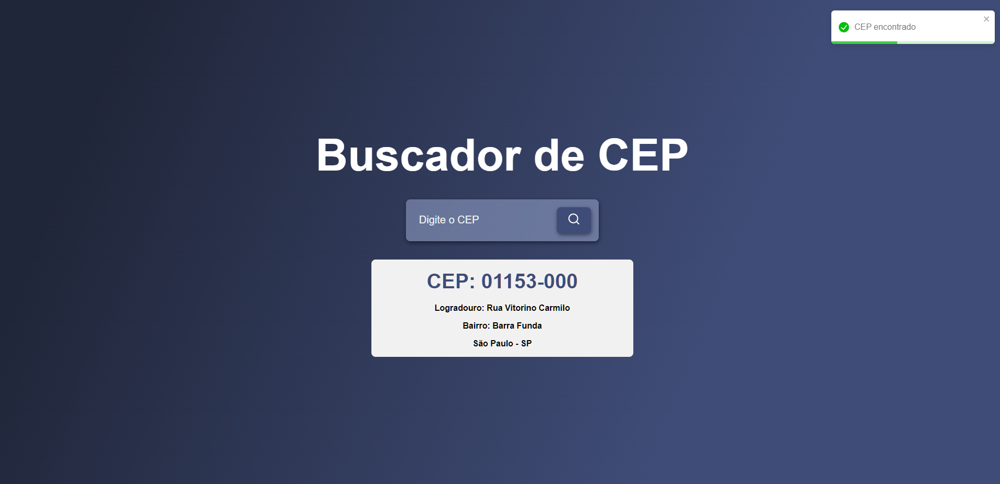

# Busca CEP

Este é um projeto simples de landing page em React que permite buscar informações de um CEP brasileiro, utilizando a API pública do ViaCEP.



## Funcionalidades

- Busca informações de um CEP, como logradouro, complemento, bairro, cidade e estado caso estejam presentes na API.
- Formatação automática do campo de input para o formato de CEP: `XXXXX-XXX`.
- Exibição de notificações de sucesso ou erro ao buscar o CEP.

## Tecnologias Utilizadas

- **React**: Biblioteca JavaScript para construção da interface do usuário.
- **Axios**: Cliente HTTP para realizar requisições à API do ViaCEP.
- **React-Toastify**: Biblioteca para exibir notificações.
- **React-Input-Mask**: Biblioteca para adicionar máscara de formatação ao campo de input.
- **ViaCEP API**: API pública para buscar informações de um CEP brasileiro.

## Instalação

### Pré-requisitos

- Node.js instalado na sua máquina.
- Gerenciador de pacotes npm ou yarn.

### Passos para rodar o projeto

1. Clone este repositório:

   ```bash
   git clone https://github.com/leefell/Busca-CEP.git
    ```

2. Navegue até o diretório:

    ```bash
    cd Busca-CEP/buscacep
    ```

3. Instale as Depedências com o npm ou yarn:
    ```bash
    npm install
    ```

    ```bash
    yarn install
    ```

4. Inicie a aplicação com o npm ou yarn.
    ```bash
    npm start
    ```

    ```bash
    yarn start
    ```

5. O projeto estará rodando em ```http://localhost:3000.```

O intuito desse projeto é estudar e compreender como funciona a comunicação com uma API simples usando Axios e React. O foco principal é aprender a realizar requisições HTTP e gerenciar respostas de APIs, além de praticar a integração de dados em uma aplicação React. Este projeto serve como um exercício prático para melhorar as habilidades na manipulação de dados vindos de uma API e na construção de interfaces.